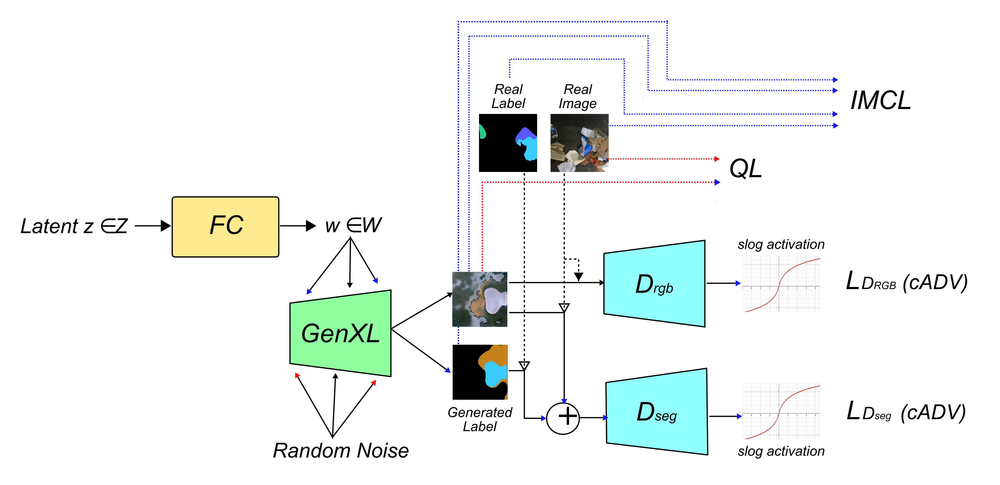

# WasteGAN

This repository refers to the work **WasteGAN: Data Augmentation for Robotic Waste Sorting through
Generative Adversarial Networks**. If you use this code or part of it in your work, please cite: 

```
@misc{bacchin2024wastegandataaugmentationrobotic,
      title={WasteGAN: Data Augmentation for Robotic Waste Sorting through Generative Adversarial Networks}, 
      author={Alberto Bacchin and Leonardo Barcellona and Matteo Terreran and Stefano Ghidoni and Emanuele Menegatti and Takuya Kiyokawa},
      year={2024},
      eprint={2409.16999},
      archivePrefix={arXiv},
      primaryClass={cs.RO},
      url={https://arxiv.org/abs/2409.16999}, 
}

```
Accepted to the "2024 IEEE/RSJ International Conference on Intelligent Robots and Systems" (IROS 2024). 

#WasteGAN Architcture



*Repository still under construction. If you notice some issues, feel free to let us know.*

# How to install

```
pip install -r requirements.txt
```

# How to use

## Training

You can use the script `trainStyleGAN_mask_dualDrgb.py`. The script can be configured using the file `config/styleGAN2-ada_dualDrgb_SS.yaml`, you can find the following sections:
- **CUSTOMIZATIONS**: customize the training with the customization introduced lile IMC Loss, custom Adversarial Loss, ect... 
- **TRAINING PARAMS**: modify network architecture and training hyperparametirs like learning rates, training steps and loss weights. 
- **DATA PATH**: from where to load data and where to save models and logs
- others... 

For example, if you want to use IMC Loss and generator XL during the training, your CUSTOMIZATIONS section looks like: 

```yaml
##CUSTOMIZATIONS
##############################
use_imcLoss: True
use_sharpFeat: False
use_adaCustom: False
use_advCustom: False
use_symLogAct: False
symLogAct_a: 2
use_genXL: True
```

Once the configuration is completed, you can run: 

```
python3 trainStyleGAN_mask_dualDrgb.py . 
```
The argument passed in the command line is the prefix added to all the paths in the script. 

The scrpit will automatically create the log files with a custom name. 

## Dataset Generation

To generate a synthetic dataset using a pre-trained GAN you can use `generateAugDataset.py` script. The script can be configured using the file `config/generation.yaml`. The structure is similar to the aforementioned configuration files. 

The script loads the model from `prefix` + `root` + `test_id` + `customizations` + `model_step` + `pretrained_G` and `pretrained_W` values of the config file. The defualt values are directly linked to the structure created by the training script. 

The script saves the results in `prefix` + `save_path` + `test_id` + `customizations`. 

You set the number of synthetic examples using `dataset_size`. 

For example, if you want to a model trained with IMC Loss and generator XL, your CUSTOMIZATIONS section looks like: 

```yaml
##CUSTOMIZATIONS
##############################
use_imcLoss: True
use_sharpFeat: False
use_adaCustom: False
use_advCustom: False
use_symLogAct: False
symLogAct_a: 2
use_genXL: True
```

Once the configuration is completed, you can run: 

```
python3 generateAugDataset.py . 
```
The argument passed in the command line is the `prefix` added to all the paths in the script. 

## Train and Test on ZeroWaste Dataset

[ZeroWaste](http://ai.bu.edu/zerowaste/) is a dataset acquired in a paper sorting plant. We used ZeroWaste to train the GAN and test it.

### Ablation Study

The script `trainTestGANAblation.py` allows to execute an ablation study. Given the datasets in the folder `./AugDatasets`, you can train and test different segmentation networks. 
The scripts takes in inputs many arguments (use `--help` for furthers), here the most important ones:
- `real_size`: number of real examples used in the training set, default=100
- `epochs`: number of training epochs, default=20
- `prefix`: prefix to be add in front of each path, default="""
- `split_root`: where to retrieve real training and test, default="dataSplit1000"

```
python3 trainTestGANAblation.py 
```

The results will be saved in the folder `prefix/ablation_results`. The script saves a JSON file with log information and `.pth` files with the models.

### Model test

The script `trainTestGANAug.py` allow to test multiple models, given a specific dataset generated by the GAN. 
The scripts takes in inputs many arguments (use `--help` for furthers), here the most important ones:
- `real_size`: number of real examples used in the training set, default=100
- `epochs`: number of training epochs, default=20
- `prefix`: prefix to be add in front of each path, default="""
- `split_root`: where to retrieve real training and test, default="dataSplit1000"
- `use_[...]`: select which model have been used to generate the dataset, default=False

```
python3 trainTestGANAug.py 
```

The results will be saved in the folder `prefix/test_results`. The script saves a JSON file with log information and `.pth` files with the models.

## Test on ZeroWaste-v2 Dataset

[ZeroWaste-v2](https://ai.bu.edu/visda-2022/) have been proposed within the scope of VisDA-2022 (Visual Domain Adaptation) Challenge. To test on ZeroWaste-v2, you can run:

```
python3 trainTestGANAug.py 
```
The scripts takes in inputs many arguments (use `--help` for furthers), here the most important ones:
- `prefix`: prefix to be add in front of each path, default="""
- `split_root`: where to retrieve test images, default="zerowaste-v2"
- `models_folder`: where to retrieve test images, default="./test_results"

The results are saved into `.json` files in the `test_zerowaste_v2` folder. 


